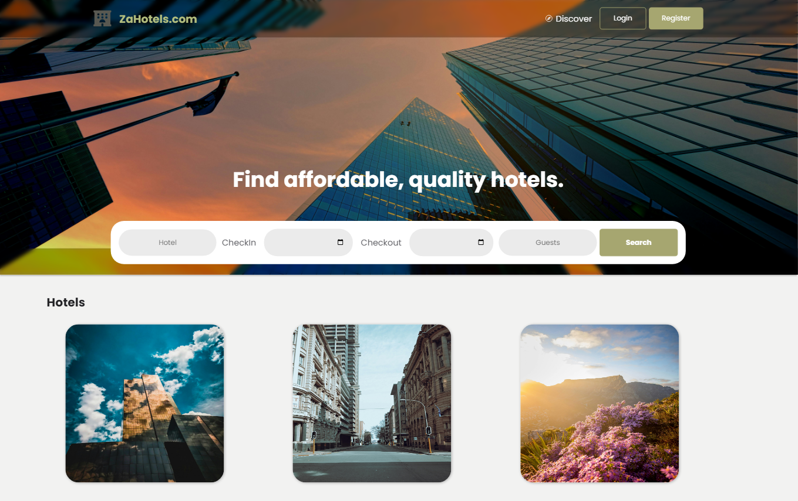
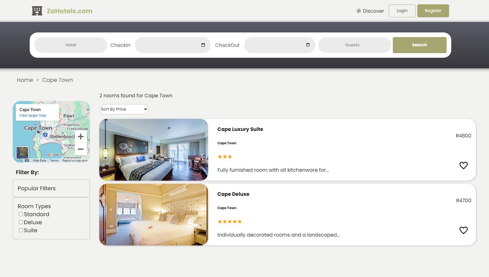

# React + Firebase Hotel Booking App | CLIENT

React hotel booking/management app using firebase as storage and database. This is the client side of the web app, where users can create an account and book hotel rooms in different locations.

## Installation

1. Clone the repository

```bash
git@github.com:Lspacedev/hotel-booking-app.git
```

2. Navigate to the project folder

```bash
cd hotel-booking-app
```

3.  Install all dependencies

```bash
npm install
```

4. Create an env file and add Firebase SDK config keys (go to /src/config/firebase.jsx for variable naming), STRIPE_PUBLISHABLE_KEY, STRIPE_PRICE_ID

5. Run the project

```bash
npm run dev
```

## Screenshot




## Features

Users

- Authentication: Create a user account.
- Authentication: Login to your account.

- Track your room bookings.
- View notifications.
- Add and view hotel room reviews.
- Add and remove likes/favourites.
- Update account information.

Hotels

- Search hotel rooms based on location or room type.
- Filter hotels based on room types i.e Standard, Deluxe, Suite.
- Sort search results by price, highest to lowest and lowest to highest
- View location on map
- View hotel room gallery/images.
- View hotel room details i.e decription, amenties, policies, rating and reviews.
- Like hotel room.
- Share hotel room.
- Book hotel room.

Payment

- Users can pay for their bookings, using Stripe Payment.

## Usage

1. Open the live site in your browser.
2. Search hotel using one of 3 locations, i.e Pretoria, Johannesburg and Cape Town.
3. You can also search for hotels using guests and checkin and out dates.
4. Find a hotel you like, and book. If you have not set checkin and out dates, it will prompt you to do so. If you have not logged in, you'll be prompted to do so.
5. After pressing book, you'll be taken to a payment gateway, use one of the Stripe fake cards to test.
6. After a succesfull payment, track the booked room in your dashboard.

## Stipe Test Cards:

```python
https://docs.stripe.com/testing
```

## Tech Stack

- ReactJs
- Firebase

## Credits:

```python
Photo by Jimmy Chan: https://www.pexels.com/photo/several-lighted-high-rise-buildings-933337/
Photo by Rebecca Meenach: https://www.pexels.com/photo/city-buildings-under-the-blue-sky-14577907/
Photo by Johannes Plenio from Pexels: https://www.pexels.com/photo/worm-s-eye-view-of-buildings-1632788/
Photo by Silver Works: https://www.pexels.com/photo/low-angle-photography-of-building-2003762/
Photo by Thobile Nhlapo: https://www.pexels.com/photo/bank-buildings-in-a-narrow-street-18264521/
Photo by Taryn Elliott: https://www.pexels.com/photo/photo-of-mountain-during-dawn-3889935/
Derek Jensen (Tysto), Public domain, via Wikimedia Commons
Photo by Eugenia Remark: https://www.pexels.com/photo/an-elegant-modern-hotel-room-design-16975987/
Photo by Pixabay: https://www.pexels.com/photo/silver-and-white-desk-lamp-beside-bed-279805/
<a href="https://www.freepik.com/free-vector/planning-illustration_19635378.htm#fromView=author&page=2&position=48&uuid=9282d6e1-7d19-423f-9db3-7a65fadf192c">Image by vectorjuice on Freepik</a>
```

## Flows:

```python
https://www.figma.com/board/CJ0hyIKh69osFRaYgrpzGJ/Hotel-App-User-Flow?node-id=0-1&node-type=canvas
```
